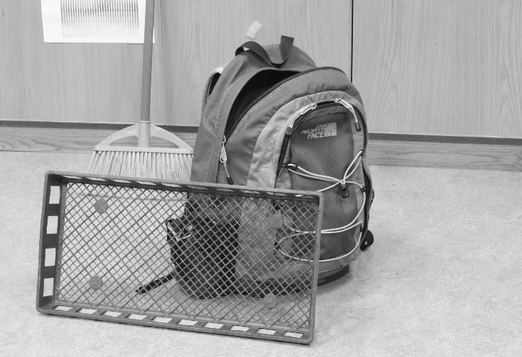
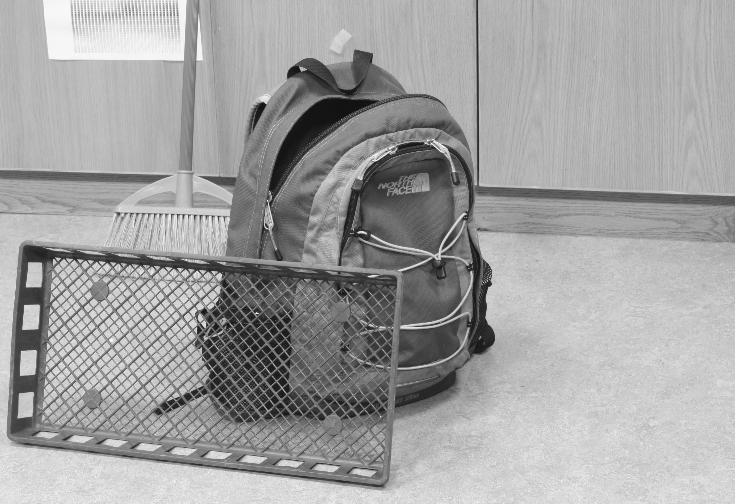
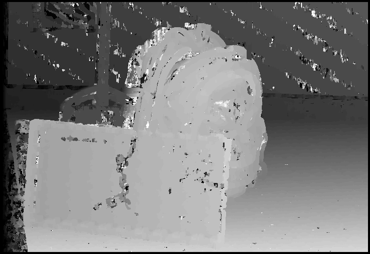
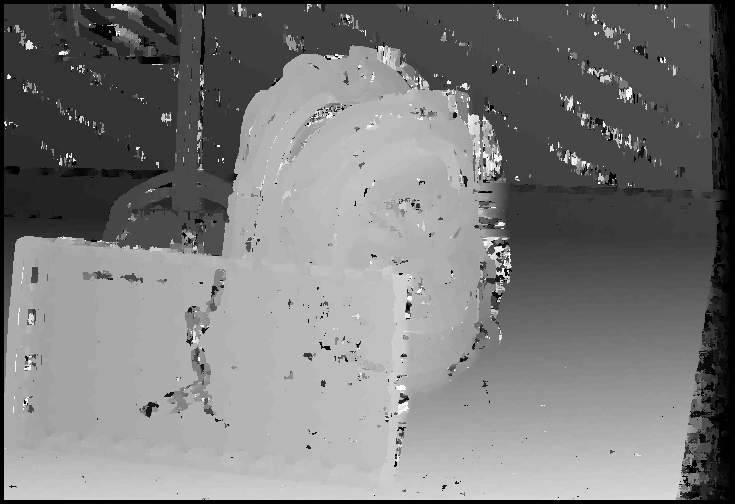
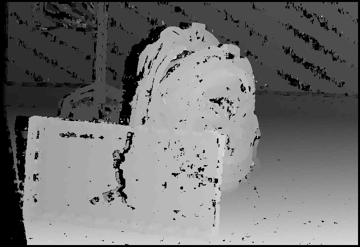
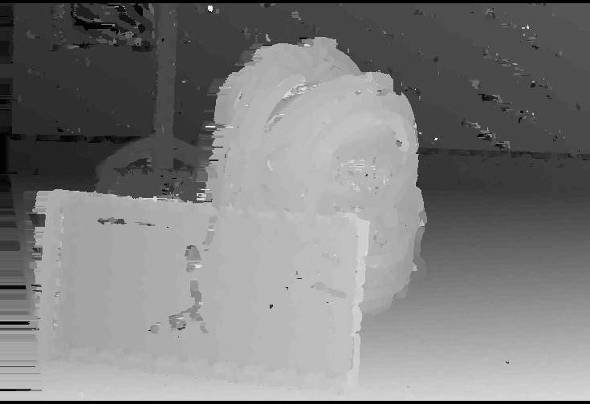
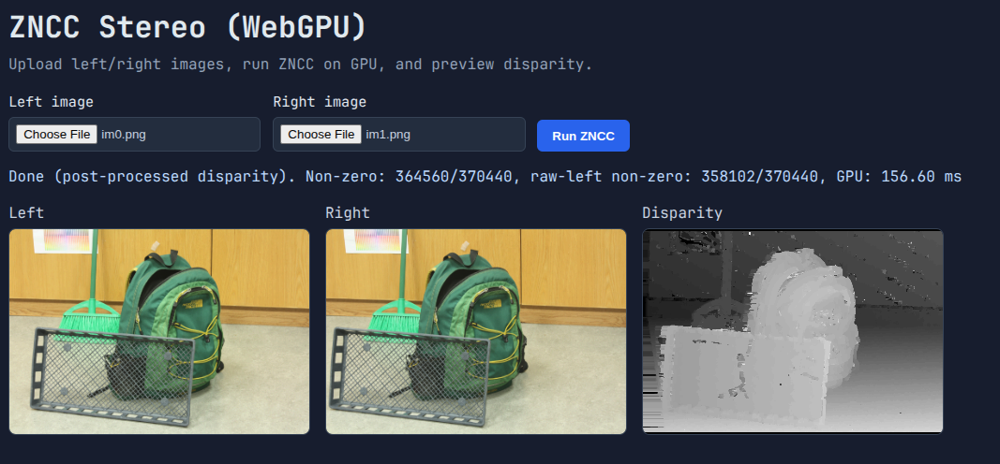

## Introduction

This project implements a stereo depth estimation pipeline using the Zero-mean Normalized Cross-Correlation (ZNCC) algorithm. The input is a pair of stereo rectified images. The pipeline consists of: resize + grayscale conversion, ZNCC disparity search, cross-check post-processing, and occlusion filling. The output is a normalized depth map.

## Single-Threaded C++ (23 s)

The baseline implementation in `main_single.cpp`. The pipeline runs fully sequentially on one core:

- **Resize + grayscale**: nearest-neighbour downscale by 4, ITU-R BT.601 luminance coefficients (0.2126 R + 0.7152 G + 0.0722 B).

| Left                             | Right                             |
| -------------------------------- | --------------------------------- |
|  |  |

- **ZNCC**: for each pixel, computes the left-window mean and std once, then iterates over all disparities (0–64). For each disparity the right-window mean, std, and cross-correlation are recomputed from scratch, O(W² × D) per pixel.

| Left                             | Right                             |
| -------------------------------- | --------------------------------- |
|  |  |

- **Cross-check**: marks pixels where `|disp_left[x] - disp_right[x - disp_left[x]]| > 8` as invalid (zero).

- **Occlusion fill**: for each zero pixel, scans left and right to find the nearest nonzero neighbour — O(W) average per zero pixel.

Most of the 23 s is spent in the ZNCC loops. With a 9×9 window and MAX_DISP = 65, each pixel does up to 65 × 81 multiply-accumulates, and the whole image has ~500 K pixels.

| Stage               | Time (Without compiler optimizations) | Time (With compiler optimizations) |
| ------------------- | ------------------------------------- | ---------------------------------- |
| Resize + Grayscale  | 11.28941 ms                           | 1.684809 ms                        |
| ZNCC (left + right) | 23341.9 ms                            | 8859.16 ms                         |
| Cross-check         | 4.91692 ms                            | 0.396163 ms                        |
| Occlusion fill      | 26.759 ms                             | 4.45408 ms                         |
| **Total**           | **23384.9 ms**                        | **8865.7 ms**                      |

---

## SIMD-Accelerated C++ (`main_simd.cpp`, 9 s)

This path was suggested after the first checkpoint. Two main ideas applied:

**1. Integral images for O(1) window statistics.** Instead of recomputing the sum and sum-of-squares of each window from scratch, precomputed prefix-sum tables (`IntegralImage`) allow mean and variance of any window to be retrieved in four table lookups. This eliminates the O(W²) cost for mean/std per disparity step.

**2. AVX2 vectorization of the cross-correlation.** The inner loop over window rows is unrolled to process 8 floats at a time with `_mm256_fmadd_ps`. The resize and grayscale steps are fused into a single `ResizeGray` pass that also uses AVX2 to process 8 output pixels per iteration.

**3. Two-pass occlusion fill.** Replaced the O(W²)-worst-case fill scan with a left→right pass followed by a right→left pass, each O(W).

The ZNCC kernel went from ~23 s to ~9 s. It's quite impressive how the compiler can squeeze the 9s ZNCC loop to 660 ms.

| Stage                   | Time (Without compiler optimizations) | Time (With compiler optimizations) |
| ----------------------- | ------------------------------------- | ---------------------------------- |
| Resize + Grayscale      | 2.60029 ms                            | 1.525505 ms                        |
| ZNCC                    | 9460.66 ms                            | 660.444 ms                         |
| Cross-check             | 4.86962 ms                            | 0.401519 ms                        |
| Occlusion fill (2-pass) | 1.7835 ms                             | 0.276883 ms                        |
| **Total**               | **9469.92 ms**                        | **662.648 ms**                     |

---

## OpenMP Multithreaded (`main_multi.cpp`, 3 s)

Built on the single-threaded version with `#pragma omp parallel for` added to the outer loop of ZNCC, cross-check, and occlusion fill. The Ryzen 7 4800H has 8 cores / 16 threads so the ZNCC work is distributed across rows with `schedule(dynamic, 4)` to handle the variable disparity limit near image edges.

Integral images are not used here (this was done before the single threaded SIMD implementation). The speedup is close to linear with core count for ZNCC since each row is independent.

The single threaded SIMD is faster than 16 threads without explicit SIMD. I used to live by the idea of "don't try to outsmart the compiler" but in this case it seems we did outsmart the compiler.

| Stage              | Time (Without compiler optimizations) | Time (With compiler optimizations) |
| ------------------ | ------------------------------------- | ---------------------------------- |
| Resize + Grayscale | 3.605389 ms                           | 3.146764 ms                        |
| ZNCC               | 2571.23 ms                            | 942.527 ms                         |
| Cross-check        | 1.89053 ms                            | 3.68763 ms                         |
| Occlusion fill     | 16.6354 ms                            | 3.48482 ms                         |
| **Total**          | **2593.36 ms**                        | **952.846 ms**                     |

---

## OpenCL GPU (`kernels_old.cl`, ~100 ms)

The first GPU port in `main_gpu.cpp` maps each pipeline step to an OpenCL kernel:

- `resize_image`: 2D NDRange, each thread copies one pixel (nearest-neighbour at 4× offset) using image objects and the built-in sampler.
- `convert_grayscale`: 2D NDRange, reads from the resized image object and writes a flat uchar buffer.
- `zncc`: single kernel computing both left and right disparity maps. Each work-item handles one pixel, replicating the scalar logic from the CPU version, global reads for every window access.
- `cross_check`: simple 2D kernel.
- `occlusion_fill`: 1D kernel (one thread per row), serial scan within each thread.

The jump from 3 s to ~100 ms comes from massive parallelism: the 1660 Ti has 1536 CUDA cores (mapped to OpenCL CUs) running thousands of threads simultaneously. Even without local memory, the GPU's memory bandwidth and latency hiding hide most of the global read cost.

Known issues in this version: no bounds guards on resize/grayscale for padded threads, single monolithic zncc kernel with redundant memory reads, and the slow serial fill.

| Stage                 | Time (Vega 7 iGPU) | Time (1660 Ti) |
| --------------------- | ------------------ | -------------- |
| CPU -> GPU transfer   | 57.2943 ms         | 8.92968 ms     |
| resize × 2            | 3.31751 ms         | 0.19174 ms     |
| grayscale × 2         | 0.09177 ms         | 0.208128 ms    |
| zncc                  | 142.209 ms         | 25.4159 ms     |
| cross_check           | 0.040436 ms        | 0.02048 ms     |
| occlusion_fill        | 140.461 ms         | 58.4757 ms     |
| GPU -> CPU transfer   | 3.63119 ms         | 0.142387 ms    |
| **GPU kernels total** | **283.774 ms**     | **91.854 ms**  |
| **Total**             | **344.7 ms**       | **100.926 ms** |

---

## Optimized OpenCL GPU (`kernels_optimized.cl`, ~28 ms on 1660 Ti)

Three main optimizations applied to the GPU kernels (`kernels_optimized.cl`), driven by profiling of the baseline:

### OPT-A: Two-pass Occlusion Fill

The original `occlusion_fill` kernel runs one thread per row with a nested scan... O(W²) in the worst case. Replaced with two kernels:

- `fill_pass1` (left→right): each thread walks its row once, tracking the last seen nonzero value and its distance. Writes `(fill_value, distance)` pairs to a scratch buffer (2 bytes/pixel).
- `fill_pass2` (right→left): reads the scratch, also tracks the nearest-right nonzero, and picks whichever direction is closer.

This makes the fill O(W) per row, parallel across rows.

### OPT-B: Sliding Column-Sum for Right-Window Mean

In the original ZNCC, for each disparity step `d` the right (or left) window sum is recomputed from scratch O(W²) per step. With sliding column sums (`row_sum[]` array), started at d=0 and updated by adding one new column and dropping one old column per step, the mean update cost drops to O(W) per disparity step. The cross-correlation inner loop is still O(W²) but now dominates cleanly rather than being half-hidden by redundant sum work.

### OPT-C: uchar Tiles in Local Memory

The baseline zncc kernel reads from global memory for every window pixel. The optimized kernels load tiles into local memory (`__local uchar tile_l[]`, `__local uchar tile_r[]`) at the start of each workgroup. Storing tiles as `uchar` instead of `float` cuts LDS usage from ~9.3 KB to ~2.3 KB per workgroup. On the TU116 (48 KB LDS), this allows ~20 resident workgroups vs ~5 before [1].

Additional minor changes: `native_rsqrt` instead of `sqrt`/division, `fma` for cross-correlation accumulation, build flags `-cl-fast-relaxed-math -cl-mad-enable`, and split zncc into separate `zncc_left` / `zncc_right` kernels to allow concurrent dispatch.

| Stage                 | Time (Vega 7 iGPU) | Time (1660 Ti) |
| --------------------- | ------------------ | -------------- |
| CPU -> GPU transfer   | 0.053751 ms        | 0.015139 ms    |
| resize × 2            | 0.808959 ms        | 0.19104 ms     |
| grayscale × 2         | 0.096702 ms        | 0.031072 ms    |
| zncc left             | 27.8221 ms         | 9.4593 ms      |
| zncc right            | 27.4945 ms         | 9.41606 ms     |
| cross_check           | 0.04276 ms         | 0.017152 ms    |
| occlusion_fill pass 1 | 0.404841 ms        | 0.217216 ms    |
| occlusion_fill pass 2 | 0.593113 ms        | 0.29696 ms     |
| GPU -> CPU transfer   | 4.00354 ms         | 0.203632 ms    |
| **GPU kernels total** | **57.263 ms**      | **19.6288 ms** |
| **Total**             | **61.5654 ms**     | **27.746 ms**  |

---

## Phase 7: WebGPU Implementation (`zncc.wgsl` + `zncc.ts`, ~140 ms)

Instead of targeting ODROID, the optional phase was implemented as a browser-based WebGPU compute pipeline running on the GPU via Chromium's Vulkan backend.

The WGSL shader ports all three optimizations from the OpenCL version.

Workgroup sizes match the OpenCL tuning: 16×16 for grayscale and cross-check, 32×8 for both ZNCC kernels, 64×1 for fill passes. A 9th storage buffer binding (fill scratch) requires requesting `maxStorageBuffersPerShaderStage: 9` explicitly. GPU timestamps are recorded per-pass via the `timestamp-query` feature.

| Stage                 | Time (Vega 7 iGPU) | Time (1660 Ti) |
| --------------------- | ------------------ | -------------- |
| CPU → GPU transfer    | 92.700000 ms       | 85.000 ms      |
| Grayscale             | 0.802480 ms        | 0.111 ms       |
| ZNCC left             | 110.262720 ms      | 14.211 ms      |
| ZNCC right            | 111.163040 ms      | 14.178 ms      |
| Cross-check           | 0.123360 ms        | 0.031 ms       |
| Occlusion fill pass 1 | 2.611560 ms        | 0.313 ms       |
| Occlusion fill pass 2 | 1.497840 ms        | 0.506 ms       |
| GPU → CPU transfer    | 242.900000 ms      | 53.600 ms      |
| **GPU kernels total** | **226.4610 ms**    | **29.35 ms**   |
| **Total**             | **336.0000 ms**    | **138.8 ms**   |

The 85 ms upload and 54 ms readback dominate; the GPU kernels themselves take only 29 ms which is only ~10ms slower than native OpenCL. Both transfer times are high relative to a native driver because WebGPU maps and copies through an additional abstraction layer. The ZNCC kernels at ~14 ms each are within 50% of the 1660 Ti baseline (9.4 ms).

## References

[1] NVIDIA, “Turing GPU,” 2019. [Online]. Available: https://www.nvidia.com/content/dam/en-zz/Solutions/design-visualization/technologies/turing-architecture/NVIDIA-Turing-Architecture-Whitepaper.pdf
